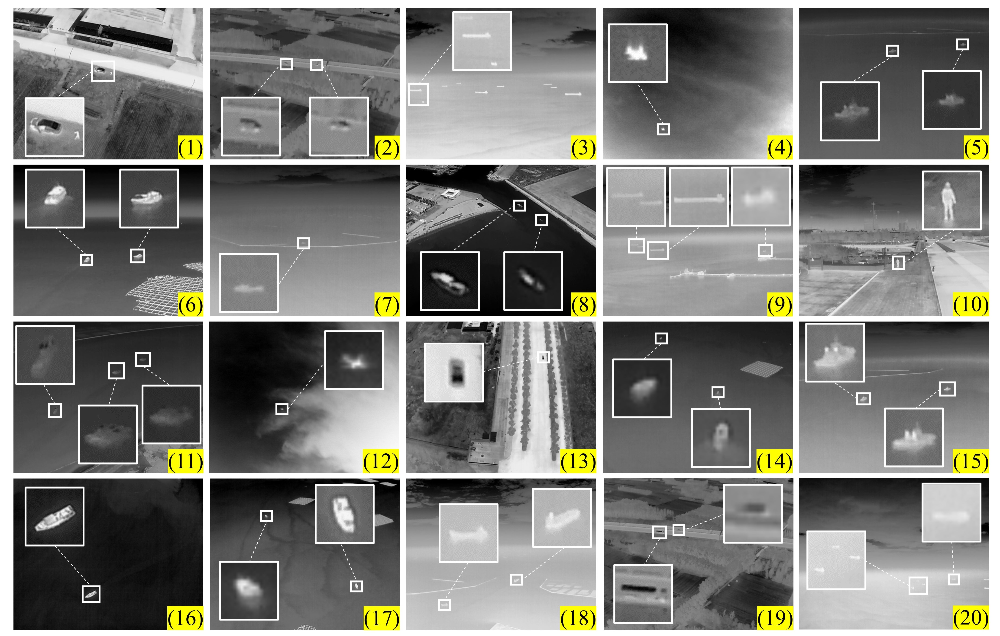
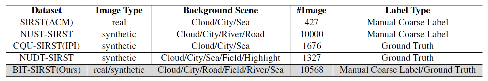

BIT-SIRST
==============

A dataset proposed in "Improved Dense Nested Attention Network Based on Transformer for Infrared Small Target Detection" <http://arxiv.org/abs/2311.08747>.

At present, our paper is still under review, and the paper code will be released when it is finished.

## Dataset Description

BIT-SIRST is a dataset specially constructed for single-frame infrared small target detection, in which the images are selected from hundreds of infrared sequences for different scenarios. 

The `\images` and `\masks` in this repository are some demos not the complete dataset. `\9000_1000` is where we split training data and test data, you can change it according to your actual application.



BIT-SIRST is a real + synthetic dataset, which contains 10568 images with resolution of 640×512. The advantage of real + synthetic data dataset：

-  Accurate synthetic data and annotations.
- Abundant real-world image and manual labels.
- Numerous categories of target, rich target sizes, diverse real-world clutter backgrounds.

In the following table we compare BIT-SIRST with other datasets.



## Download

The full BIT-SIRST download website:

（1）[Google driver](https://drive.google.com/file/d/1h2yWmiyeNNyJbuDO25nKhAexK3JBXLIz/view?usp=drive_link)

（2）[Baidu Cloud](https://pan.baidu.com/s/1tU9EpkTZ_npQe248BqJsSA?pwd=seia) [Extraction Code: **seia**]

You can download and use one of the two sites above.

## Acknowledgement

*This overall repository style is highly borrowed from [ACM](https://github.com/YimianDai/open-acm). Thanks to Yimian Dai.

*Our code is highly borrowed from [DNANet](https://github.com/YeRen123455/Infrared-Small-Target-Detection). Thanks to Boyang Li.

## Citation

Please cite our paper in your publications if our work helps your research. BibTeX reference is as follows.

```
@article{bao2023improved,
  title={Improved Dense Nested Attention Network Based on Transformer for Infrared Small Target Detection},
  author={Bao, Chun and Cao, Jie and Ning, Yaqian and Zhao, Tianhua and Li, Zhijun and Wang, Zechen and Zhang, Li and Hao, Qun},
  journal={arXiv preprint arXiv:2311.08747},
  year={2023}
}
```

